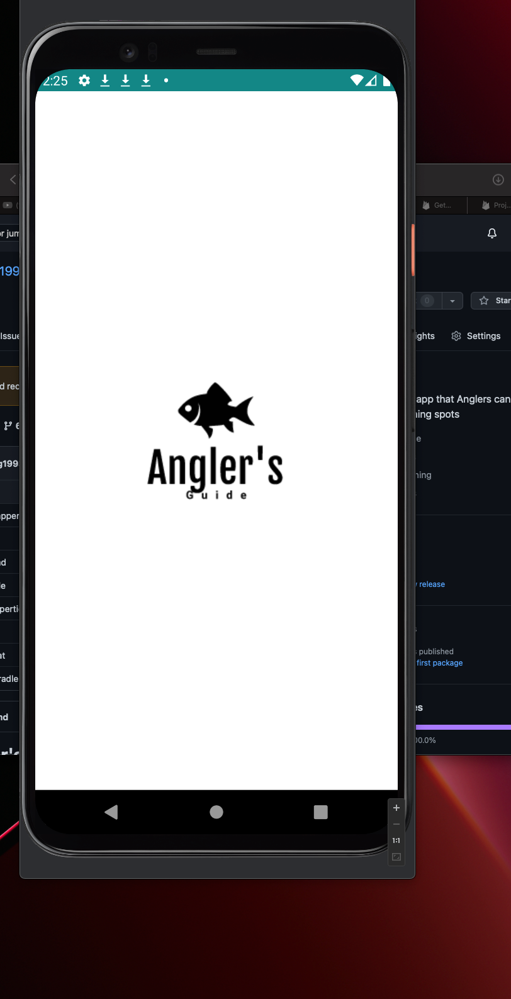
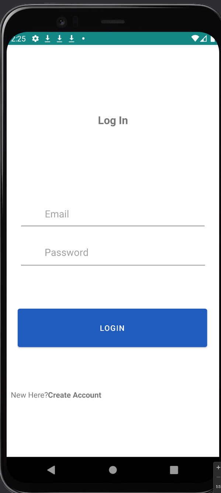
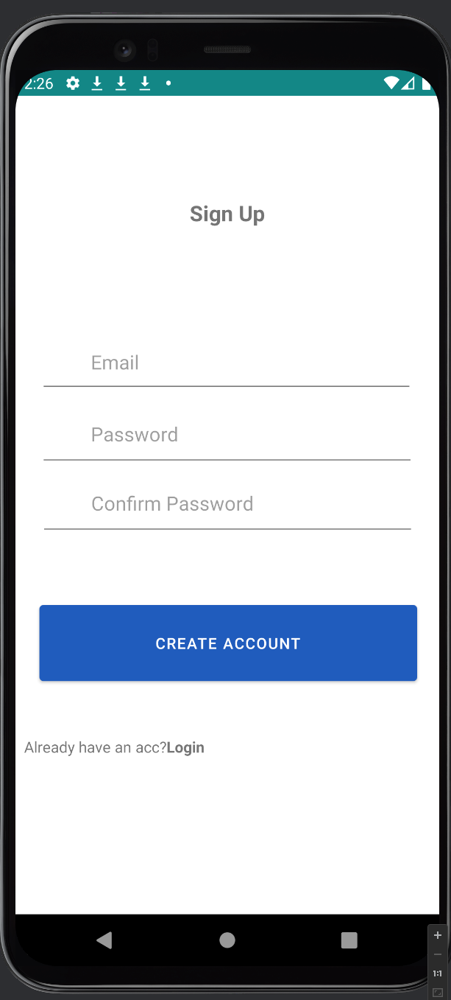
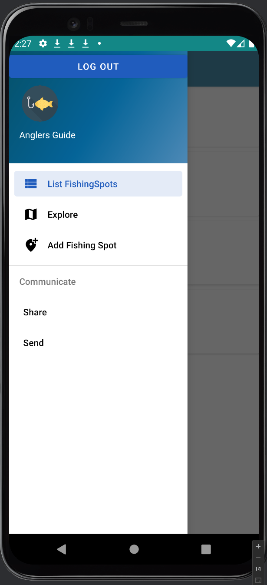
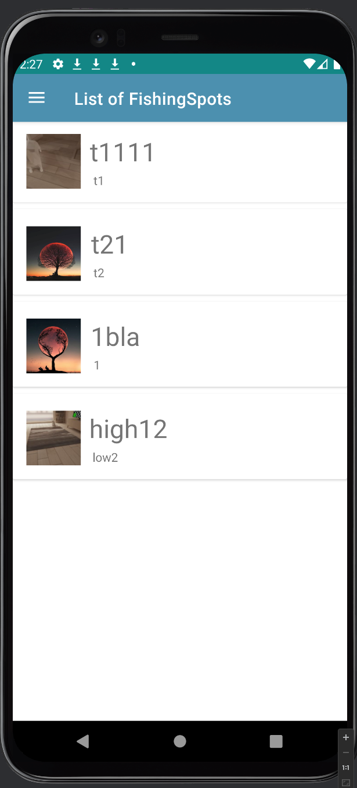
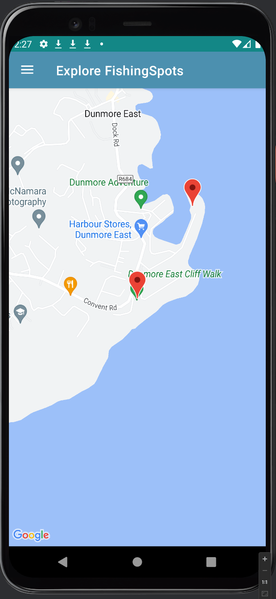
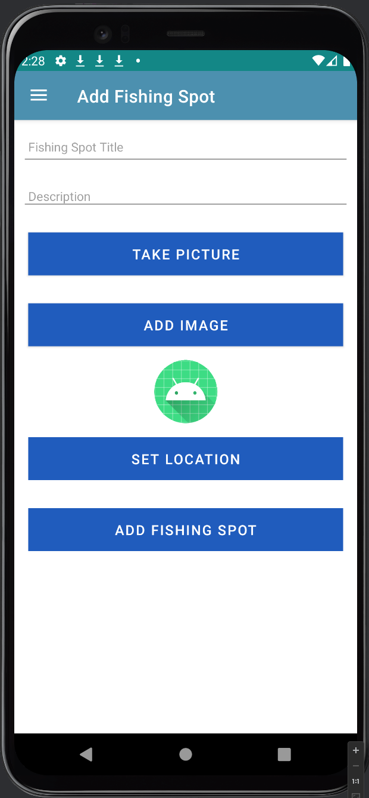

# __Angler's Guide App__

__This is an app developed in Kotlin (Android Studio)__

## Current Features
- Add Fishing Spot (Title, Desc, Image)
- Show via Card
- Edit Fishing Spot (Title, Desc, Image)
- Delete Fishing Spot (with Swipe Functionality)
- Temp Storage
- Google Maps Feature
- Persistence via json data in file
- Take photo from app and add to FishingSpot image
- User Register / Login / Signout 
- Authentication via FireBase

## Features to ADD
- UI Upgrades
- Categories in the Location Model 'Sea / Freshwater etc' (help with filter later)
- Filtering
- Testing
- Undo when deleted 
- About Us Page

## Items to Fix
- Update Bin/Delete Graphic in Delete Swipe
- Implement option to undo delete just after swiping.
- Image view size after taking picture
- Show Logged in User on Nav Drawer

## References 
- Set Result in fragment -> https://stackoverflow.com/questions/36495842/is-there-a-method-like-setresult-in-fragment
- Fragment to not save text -> https://stackoverflow.com/questions/59586068/why-does-edittext-in-fragment-show-the-same-value-after-navigating-to-another-fr
- Delete on card Swipe -> https://www.youtube.com/watch?v=eEonjkmox-0
- Cannot load Google map in Kotlin Fragment? -> https://stackoverflow.com/questions/69332790/cannot-load-google-map-in-kotlin-fragment
- Camera Integration BitMap get path etc -> https://developer.android.com/reference/android/graphics/BitmapFactory
- FireBase Auth -> https://www.youtube.com/watch?v=Gf-bttCyt7c&list=PLN8KRetF_zntkNhZxnIjGl7TjbGO7Egus&index=5